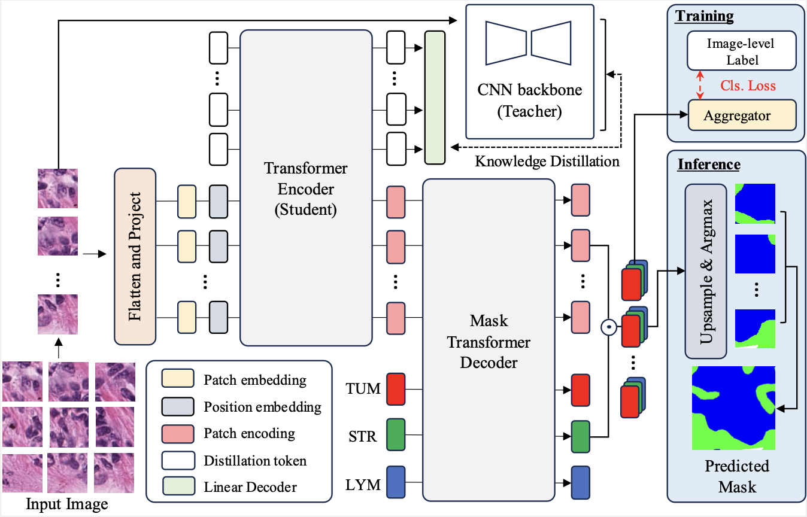
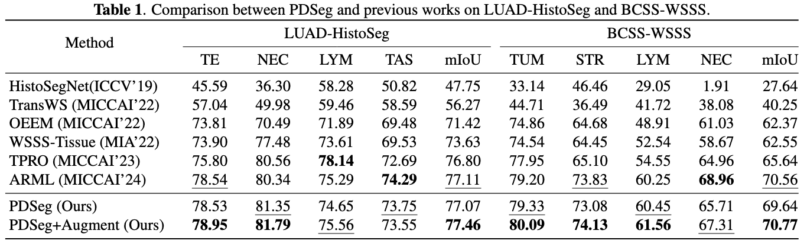

# 🔬 PDSeg: Patch-Wise Distillation and Controllable Image Generation for Weakly-Supervised Histopathology Tissue Segmentation
[](https://ieeexplore.ieee.org/abstract/document/10888097)

Welcome! 👋 This repository contains the official implementation of our **ICASSP 2025** paper:  
**"PDSeg: Patch-Wise Distillation and Controllable Image Generation for Weakly-Supervised Histopathology Tissue Segmentation"**.

We propose a novel framework that combines patch-wise knowledge distillation with controllable image generation to push the boundaries of weakly-supervised tissue segmentation in histopathology images.

---

## 🖼️ Overview

<p align="center">
  
</p>

---

<details>
  <summary>📊 <b>Click to view: Comparison on LUAD-HistoSeg and BCSS-WSSS</b></summary>

  <br>

  <p align="center">
    
  </p>

</details>

---

## ⚙️ Installation and Requirements
We are tested under:
```
python 3.11
```
If you want to install a custom environment for this code, you can run the following using [conda](https://docs.conda.io/projects/conda/en/latest/commands/install.html):
```
conda install pytorch torchvision cudatoolkit=10.1 -c pytorch
conda install matplotlib

pip install timm==0.6.13
pip install opencv-python
pip install einops
pip install scikit-learn
pip install scikit-image
```

## 📁 Datasets and Our checkpoints
You can get the LUAD-HistoSeg and BCSS-WSSS dataset from [here](https://github.com/ChuHan89/WSSS-Tissue) and our checkpoints for LUAD-HistoSeg and BCSS-WSSS: [link](https://gofile.me/5R0b8/Is9Jufem1)

If your dataset is in a different folder, make a soft-link from the target dataset to the `data` folder. We expect the following tree:
```
data/
    BCSS-WSSS/
checkpoint/
    bcss_baseline/
      best_model.pth
... other files 
```
## 🏋️ Training and Evaluation

```
bash run_bcss.sh
```

## 📝 Citation

If you find this work useful in your research, please cite our paper:

```
@inproceedings{li2025pdseg,
  title={PDSeg: Patch-Wise Distillation and Controllable Image Generation for Weakly-Supervised Histopathology Tissue Segmentation},
  author={Li, Wei-Hua and Hsieh, Yu-Hsing and Yang, Huei-Fang and Chen, Chu-Song},
  booktitle={ICASSP 2025-2025 IEEE International Conference on Acoustics, Speech and Signal Processing (ICASSP)},
  pages={1--5},
  year={2025},
  organization={IEEE}
}
```

---
Stay tuned for code release and updates!  
📬 Questions or feedback? Feel free to open an issue or contact us.
